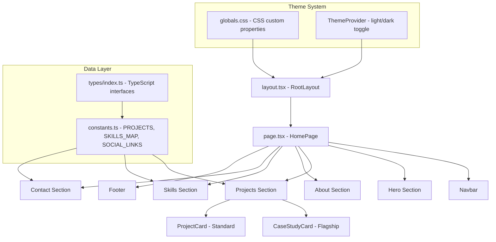

# Design Document: Portfolio Overhaul

## Overview

This design describes the transformation of the current RPG-themed portfolio into a recruiter-optimized, professional developer portfolio. The redesign retains the existing Next.js 16 App Router + TypeScript + Tailwind CSS v4 stack but replaces all fantasy UI patterns (gates, pixel borders, game stats, retro fonts) with a clean, modern design system focused on content clarity and fast evaluation.

The architecture remains a single-page scrollable layout with anchor-based navigation. Key structural changes include:
- Removing the `DungeonGate` / `LevelGate` / `GateContext` system entirely
- Replacing RPG-themed components with professional equivalents
- Introducing a `CaseStudyCard` component for flagship projects
- Adding a categorized `Skills` section with project associations
- Overhauling the CSS theme from pixel-art to a professional design system
- Updating data models to support case-study-level project detail

The page will load instantly with all content visible, achieving LCP < 2.5s, and present the developer's strongest work within the recruiter's 90-second evaluation window.

## Architecture



### Key Architectural Decisions

1. **Server Components by default** — `page.tsx` will become a Server Component (remove `"use client"`). Only components requiring interactivity (Navbar toggle, theme toggle, description expand) will be Client Components. This improves initial load performance.

2. **Data-driven rendering** — All content lives in `constants.ts` with typed interfaces. Components render from data, enabling easy updates and testable data transformations.

3. **Single-page with anchor navigation** — No routing changes needed. Sections are identified by `id` attributes and reached via smooth scroll.

4. **Framer Motion retained** — Used only for scroll-triggered reveals and hover micro-interactions, with `prefers-reduced-motion` respected via CSS media query (already partially implemented).

5. **Next.js Image component** — All images use `next/image` for automatic WebP optimization, lazy loading, and layout shift prevention.

## Components and Interfaces

### New Components

| Component | Location | Responsibility |
|-----------|----------|---------------|
| `CaseStudyCard` | `src/components/cards/CaseStudyCard.tsx` | Renders flagship project with problem statement, tech stack, challenge, links |
| `ProjectCard` (revised) | `src/components/cards/ProjectCard.tsx` | Renders standard project cards (non-flagship) |
| `SkillCategory` | `src/components/sections/SkillCategory.tsx` | Renders a skill group with project associations |
| `ContactLinks` | `src/components/sections/ContactLinks.tsx` | Renders GitHub, email, LinkedIn, resume links |
| `ScrollReveal` (revised) | `src/components/ui/ScrollReveal.tsx` | Intersection Observer-based fade-in, max 600ms |

### Removed Components

| Component | Reason |
|-----------|--------|
| `DungeonGate` | Blocks content on load (Req 1, 12) |
| `LevelGate` | Hides sections behind interaction (Req 1, 12) |
| `GateContext` | Context provider for removed gates |
| `SectionDivider` | RPG-themed dividers replaced by spacing |
| `SkillChip` | Replaced by project-associated skill display |
| `ParallaxFloat` | Parallax removed (Req 9) |

### Modified Components

| Component | Changes |
|-----------|---------|
| `Navbar` | Remove RPG labels, update to "Projects, About, Skills, Contact". Remove pixel-border, use professional styling. |
| `Hero` | Complete rewrite — remove stats, game bars, RPG framing. Add role descriptor, value prop, dual CTAs. |
| `About` | Remove "Character Bio" heading, game stats panel, skill tree. Replace with evidence-based bio ≤600 chars. |
| `Footer` | Simplify to copyright + social links |
| `ThemeToggle` | Retain but restyle to match new design system |

### Component Props Interfaces

```typescript
// CaseStudyCard
interface CaseStudyCardProps {
  project: FlagshipProject;
}

// ProjectCard (revised)
interface ProjectCardProps {
  project: Project;
}

// SkillCategory
interface SkillCategoryProps {
  category: string;
  skills: SkillEntry[];
}

// ContactLinks
interface ContactLinksProps {
  links: ContactLink[];
  resumePath?: string;
}
```

## Data Models

### Updated Type Definitions

```typescript
// src/types/index.ts

export interface NavLink {
  label: string;
  href: string;
}

export interface ProjectLink {
  label: string;
  href: string;
  icon?: "arrow" | "github";
  external?: boolean;
}

export interface Project {
  title: string;
  description: string;
  image: string;
  techStack: string[];
  status: "complete" | "in-progress";
  links: ProjectLink[];
}

export interface FlagshipProject extends Project {
  problemStatement: string;       // 1-3 sentences
  technicalChallenge: string;     // 1-2 sentences
  technicalHighlights: string[];  // Key technical achievements
}

export interface SkillEntry {
  name: string;
  projects: string[];  // Project names where this skill is demonstrated
}

export interface SkillCategory {
  category: string;  // "Primary Stack" | "Frameworks" | "Databases" | "Tools & Infrastructure"
  skills: SkillEntry[];
}

export interface ContactLink {
  platform: "github" | "linkedin" | "email";
  href: string;
  label: string;
}

export interface SocialLink {
  platform: string;
  href: string;
}

export interface SiteConfig {
  name: string;
  email: string;
  roleDescriptor: string;        // Max 60 chars
  valueProposition: string;      // Max 2 sentences
  aboutBio: string;              // Max 600 chars, max 4 sentences
  education: string;
  location: string;
  copyright: string;
}
```

### Data Constants Structure

```typescript
// src/lib/constants.ts

export const SITE_CONFIG: SiteConfig = {
  name: "Xedric Andrei Viar",
  email: "xedricandreiviar@gmail.com",
  roleDescriptor: "Full-Stack Web Developer",  // ≤60 chars
  valueProposition: "I build and ship production web applications — from database design through deployment. Currently focused on offline-first PWAs and full-stack ordering platforms.",
  aboutBio: "Full-stack web developer based in the Philippines, currently studying Computer Science at the University of Makati (expected 2029). Built and deployed Xiron, an offline-first fitness PWA with JWT auth and background sync, and Coffee Chapters, a full ordering platform with BIR-compliant tax calculation and local payment integration.",
  education: "Computer Science, University of Makati (Expected 2029)",
  location: "Philippines",
  copyright: "© 2026 Xedric Andrei Viar",
};

export const NAV_LINKS: NavLink[] = [
  { label: "Projects", href: "#projects" },
  { label: "About", href: "#about" },
  { label: "Skills", href: "#skills" },
  { label: "Contact", href: "#contact" },
];

export const FLAGSHIP_PROJECTS: FlagshipProject[] = [
  {
    title: "Xiron",
    problemStatement: "Gym-goers need a reliable way to log workouts and track strength progress even without internet connectivity.",
    description: "Progressive Web App for logging workouts and tracking strength progress. Works fully offline with automatic sync on reconnect.",
    image: "/images/project-1.png",
    techStack: ["JavaScript", "PHP", "MySQL", "Service Workers", "JWT", "REST API"],
    technicalChallenge: "Implemented background sync with conflict resolution to handle offline workout logs that need to merge with server state on reconnect.",
    technicalHighlights: ["Offline-first sync with Service Workers", "JWT authentication with email verification", "PWA installability and caching"],
    status: "in-progress",
    links: [
      { label: "Live Demo", href: "https://xiron.cu.ma", icon: "arrow", external: true },
    ],
  },
  {
    title: "Coffee Chapters",
    problemStatement: "A Philippine coffee shop needed a complete ordering system that handles local payment methods and tax compliance.",
    description: "Full-stack ordering platform covering menu browsing, order placement, GCash/Maya payment verification, and admin analytics.",
    image: "/images/project-2.png",
    techStack: ["PHP", "MySQL", "JavaScript", "Tailwind CSS"],
    technicalChallenge: "Implemented BIR-compliant VAT calculation with cascading Senior Citizen and PWD discount rules specific to Philippine tax law.",
    technicalHighlights: ["BIR-compliant VAT calculation", "GCash/Maya payment integration", "Multi-page admin dashboard with analytics"],
    status: "in-progress",
    links: [
      { label: "Live Demo", href: "https://coffeechapters.freedev.app", icon: "arrow", external: true },
    ],
  },
];

export const PROJECTS: Project[] = [
  {
    title: "Gym Management SaaS",
    description: "Multi-tenant gym management platform with member tracking, payment processing, and trainer scheduling.",
    image: "/images/project-3.svg",
    techStack: ["NestJS", "Next.js", "TypeORM", "PostgreSQL", "Turborepo"],
    status: "in-progress",
    links: [],
  },
  {
    title: "Daily Money Tracker",
    description: "Personal finance tracking application for daily expense logging and budget visualization.",
    image: "/images/project-2.svg",
    techStack: ["Next.js", "TypeScript", "Tailwind CSS"],
    status: "in-progress",
    links: [],
  },
];

export const SKILLS: SkillCategory[] = [
  {
    category: "Primary Stack",
    skills: [
      { name: "PHP", projects: ["Xiron", "Coffee Chapters"] },
      { name: "MySQL", projects: ["Xiron", "Coffee Chapters"] },
      { name: "JavaScript", projects: ["Xiron", "Coffee Chapters"] },
      { name: "TypeScript", projects: ["Gym Management SaaS", "Daily Money Tracker"] },
    ],
  },
  {
    category: "Frameworks",
    skills: [
      { name: "Next.js", projects: ["Gym Management SaaS", "Daily Money Tracker"] },
      { name: "NestJS", projects: ["Gym Management SaaS"] },
      { name: "Tailwind CSS", projects: ["Coffee Chapters", "Daily Money Tracker"] },
    ],
  },
  {
    category: "Databases",
    skills: [
      { name: "MySQL", projects: ["Xiron", "Coffee Chapters"] },
      { name: "PostgreSQL", projects: ["Gym Management SaaS"] },
    ],
  },
  {
    category: "Tools & Infrastructure",
    skills: [
      { name: "JWT", projects: ["Xiron"] },
      { name: "Service Workers", projects: ["Xiron"] },
      { name: "Turborepo", projects: ["Gym Management SaaS"] },
      { name: "REST API", projects: ["Xiron", "Coffee Chapters"] },
    ],
  },
];

export const CONTACT_LINKS: ContactLink[] = [
  { platform: "github", href: "https://github.com/xedricandreiviar", label: "GitHub" },
  { platform: "linkedin", href: "https://www.linkedin.com/in/xedric-andrei-viar-83806b396/", label: "LinkedIn" },
  { platform: "email", href: "mailto:xedricandreiviar@gmail.com", label: "Email" },
];
```

### Design System Tokens (CSS Custom Properties)

```css
/* globals.css - Professional theme replacing RPG theme */

:root,
[data-theme="dark"] {
  --color-bg-primary: #0f172a;      /* Slate 900 */
  --color-bg-card: #1e293b;         /* Slate 800 */
  --color-bg-muted: #334155;        /* Slate 700 */
  --color-text-primary: #f8fafc;    /* Slate 50 */
  --color-text-secondary: #94a3b8;  /* Slate 400 */
  --color-accent: #3b82f6;          /* Blue 500 - 4.5:1 on dark bg */
  --color-border: #334155;          /* Slate 700 */
}

[data-theme="light"] {
  --color-bg-primary: #ffffff;
  --color-bg-card: #f8fafc;
  --color-bg-muted: #f1f5f9;
  --color-text-primary: #0f172a;
  --color-text-secondary: #64748b;
  --color-accent: #2563eb;          /* Blue 600 - 4.5:1 on light bg */
  --color-border: #e2e8f0;
}

/* Type scale - 4 body sizes, 2 heading sizes */
--font-size-sm: 0.875rem;    /* 14px */
--font-size-base: 1rem;      /* 16px */
--font-size-lg: 1.125rem;    /* 18px */
--font-size-xl: 1.25rem;     /* 20px */
--font-size-h1: 2.5rem;      /* 40px */
--font-size-h2: 1.875rem;    /* 30px */

/* Spacing scale - 4px base */
--space-1: 0.25rem;   /* 4px */
--space-2: 0.5rem;    /* 8px */
--space-3: 0.75rem;   /* 12px */
--space-4: 1rem;      /* 16px */
--space-6: 1.5rem;    /* 24px */
--space-8: 2rem;      /* 32px */
--space-12: 3rem;     /* 48px */
--space-16: 4rem;     /* 64px */

/* Font family */
--font-body: "Inter", "Geist", system-ui, sans-serif;
--font-display: "Inter", "Geist", system-ui, sans-serif;
```

## Correctness Properties

*A property is a characteristic or behavior that should hold true across all valid executions of a system — essentially, a formal statement about what the system should do. Properties serve as the bridge between human-readable specifications and machine-verifiable correctness guarantees.*

### Property 1: Case Study Card Completeness

*For any* valid `FlagshipProject` data object with all required fields populated, rendering a `CaseStudyCard` component SHALL produce output containing: the project title, problem statement, technology stack (3–8 items), technical challenge text, and a live demo link. If a GitHub URL is present in `links`, it SHALL be rendered; if absent, no GitHub link element SHALL exist.

**Validates: Requirements 3.2, 3.9**

### Property 2: External Links Open in New Tab

*For any* anchor element rendered in the Portfolio_Site whose `href` starts with "http://" or "https://", that element SHALL have `target="_blank"` and `rel="noopener noreferrer"` attributes present.

**Validates: Requirements 3.8, 6.7**

### Property 3: Skill-Project Association Display

*For any* skill rendered in the Skills_Section, the rendered output SHALL include visible text referencing at least one project name from the `projects` array associated with that skill in the data model.

**Validates: Requirements 5.2**

### Property 4: Skills Only From Featured Projects

*For any* skill rendered in the Skills_Section, that skill's `projects` array SHALL contain at least one project title that appears in either `FLAGSHIP_PROJECTS` or `PROJECTS` data arrays.

**Validates: Requirements 5.4, 5.5**

### Property 5: Color Contrast Compliance

*For any* combination of the accent color and background color defined in the theme (both light and dark variants), the computed contrast ratio SHALL be at least 4.5:1 per WCAG 2.1 AA standards.

**Validates: Requirements 7.2**

### Property 6: Social Link URL Validity

*For any* social link rendered in the Portfolio_Site, the `href` SHALL contain a path segment beyond the domain root (i.e., it must not be just "https://platform.com" or "https://platform.com/" without a user-specific identifier).

**Validates: Requirements 12.3, 12.6**

### Property 7: Experience Entry Dev-Relevance Filter

*For any* experience entry rendered on the page, its `tools` array SHALL contain at least one item that is a recognized programming language, framework, or software development methodology.

**Validates: Requirements 12.4**

### Property 8: Image Alt Text Includes Project Title

*For any* project rendered in a `CaseStudyCard` or `ProjectCard`, the associated `` element's `alt` attribute SHALL contain the project's title string.

**Validates: Requirements 13.3**

## Error Handling

### Image Loading Failures
- When a project image fails to load (404, network error), display a styled placeholder `<div>` with a background color matching `--color-bg-muted` and a text label showing the project type (e.g., "Fitness App", "Coffee Shop").
- The placeholder SHALL maintain the same aspect ratio as a loaded image to prevent layout shift.
- Use Next.js Image `onError` callback to toggle a fallback state.

### Missing Resume PDF
- Check for resume file existence at build time or via a static import attempt.
- If the file doesn't exist, the resume download button is conditionally excluded from the render tree (not hidden with CSS, but not rendered at all).

### Navigation to Missing Sections
- Anchor links use `scroll-behavior: smooth` in CSS. If the target `id` doesn't exist in the DOM, the browser natively does nothing — no navigation occurs.
- The `Navbar` intersection observer gracefully handles missing section elements by skipping them.

### Contact Form Errors
- Retain existing error handling pattern (try/catch with status state).
- Remove RPG-themed error messages — use plain, professional language.

### Theme Persistence
- `localStorage` access wrapped in try/catch to handle private browsing modes where storage may throw.
- Falls back to system preference (`prefers-color-scheme`) if localStorage is unavailable.

## Testing Strategy

### Unit Tests (Example-Based)

Unit tests cover specific rendering scenarios, content constraints, and accessibility requirements:

- **Hero Section**: Verify h1 content, role descriptor length ≤60 chars, CTAs present, no RPG terminology
- **About Section**: Verify bio ≤600 chars, ≤4 sentences, references 2+ projects, no subjective descriptors without evidence
- **Navigation**: Verify correct labels (no RPG terms), fixed position, active state differentiation
- **SEO Metadata**: Verify title length, OG tags present, meta description length, JSON-LD schema
- **Accessibility**: Verify aria-expanded on mobile toggle, alt text on images, touch target sizes
- **Theme**: Verify localStorage persistence, correct CSS custom property application

### Property-Based Tests

Property tests verify universal correctness across all valid inputs using the `fast-check` library for TypeScript.

**Configuration:**
- Minimum 100 iterations per property test
- Each test tagged with: `Feature: portfolio-overhaul, Property {N}: {title}`

**Properties to implement:**
1. Case Study Card Completeness — Generate random `FlagshipProject` objects, render `CaseStudyCard`, assert all fields present/absent correctly
2. External Links — Collect all rendered `<a>` elements with external hrefs, assert attributes
3. Skill-Project Display — Generate skill data, render `SkillCategory`, assert project names visible
4. Skills from Featured Projects — Assert every rendered skill maps to an existing project
5. Color Contrast — Compute contrast ratios for all accent/background combinations
6. Social Link Validity — Generate social link arrays, assert rendered links have user-specific paths
7. Dev-Relevance Filter — Generate experience entries with varying tools, assert filtering correctness
8. Image Alt Text — Generate project data, render cards, assert alt text contains title

### Integration / E2E Tests

- **Lighthouse CI**: Assert LCP < 2.5s on simulated 4G
- **Visual Regression**: Screenshot comparisons at 320px, 768px, 1440px viewports
- **Navigation Scroll**: Click nav links and verify smooth scroll to correct sections
- **Responsive Layout**: Assert no horizontal overflow at viewport breakpoints
- **Theme Toggle**: Toggle themes and verify correct color application

### Test Library Choices

| Type | Library | Reason |
|------|---------|--------|
| Unit / Component | Vitest + React Testing Library | Fast, integrates with Next.js, standard for React |
| Property-based | fast-check | TypeScript-native PBT library, integrates with Vitest |
| E2E | Playwright | Cross-browser, viewport testing, performance metrics |
| Visual Regression | Playwright screenshots | Built into Playwright, no extra tooling |
