# Design Document: Portfolio Visual Enhancements

## Overview

This design describes a set of visual enhancements for the existing Next.js portfolio site. The goal is to elevate the site from a clean, functional portfolio into a polished, visually engaging experience that impresses potential employers — without compromising performance or accessibility.

The enhancements are purely presentational: floating tech icons, subtle background textures, interactive card effects, glow highlights, animated skill reveals, profile image floating animation, and section divider accents. All animations respect `prefers-reduced-motion`, all decorative elements are hidden from assistive technology, and no new heavy dependencies are introduced — everything builds on the existing framer-motion + Tailwind CSS + CSS custom properties infrastructure.

### Design Decisions

| Decision | Choice | Rationale |
|----------|--------|-----------|
| Animation library | framer-motion (existing) | Already in the project, supports `useReducedMotion`, no bundle cost increase |
| Floating icons approach | CSS keyframe + framer-motion | CSS handles the continuous drift (GPU-composited), framer-motion handles reduced-motion detection and initial render |
| Background pattern | CSS `radial-gradient` | Zero additional network requests, theme-aware via custom properties, graceful degradation |
| Card hover effects | CSS transitions | Simpler than JS-driven animation for hover states, inherently respects `prefers-reduced-motion` media query |
| Glow effects | CSS `box-shadow` | GPU-composited, no paint layers, animates smoothly with transitions |
| Section dividers | Decorative `<div>` with gradient background | Semantic (not `<hr>`) so no screen reader announcement needed, just `aria-hidden` |

## Architecture

```mermaid
graph TD
    subgraph Page["page.tsx"]
        Hero
        Divider1["SectionDivider"]
        Projects["FeaturedProjects"]
        Divider2["SectionDivider"]
        About
        Divider3["SectionDivider"]
        Skills
        Divider4["SectionDivider"]
        Contact["ContactLinks"]
    end

    subgraph HeroEnhancements["Hero Enhancements"]
        FloatingIcons["FloatingIcons"]
        GradientGlow["Gradient + Glow Backdrop"]
        ProfileFloat["Profile Floating Animation"]
        HeroStagger["Staggered Text Entry"]
    end

    subgraph CardEnhancements["Card Enhancements"]
        HoverEffects["CSS Hover Effects (ProjectCard)"]
    end

    subgraph GlobalEnhancements["Global Enhancements"]
        BackgroundPattern["Background Dot Pattern (globals.css)"]
        ButtonGlow["Button/Link Glow Effects"]
        SkillStagger["Skill Tag Stagger Animation"]
    end

    Hero --> FloatingIcons
    Hero --> GradientGlow
    Hero --> ProfileFloat
    Hero --> HeroStagger
    Projects --> HoverEffects
    Skills --> SkillStagger
    Page --> BackgroundPattern
```



### Component Hierarchy

The enhancements layer into the existing component tree:

- `page.tsx` — adds `SectionDivider` components between sections
- `Hero.tsx` — converted to client component; adds `FloatingIcons`, gradient backdrop, glow pulse, profile float animation, staggered text entry
- `ProjectCard.tsx` — adds CSS classes for hover lift/shadow/border transitions
- `CaseStudyCard.tsx` — same hover treatment as ProjectCard
- `Skills.tsx` / `SkillCategory.tsx` — wraps in `ScrollReveal` and `StaggerContainer`
- `globals.css` — adds background dot pattern, glow utility classes
- `Button.tsx` — adds glow box-shadow on hover
- `SocialIconButton.tsx` — adds glow box-shadow on hover

## Components and Interfaces

### New Components

#### `FloatingIcons`

A client component that renders technology SVG icons drifting slowly across the Hero section background.

```typescript
// src/components/ui/FloatingIcons.tsx
"use client";

interface FloatingIconConfig {
  id: string;
  icon: string;        // Technology name key
  size: number;        // 24–48px
  opacity: number;     // 0.08–0.20
  x: number;           // Initial X position (%)
  y: number;           // Initial Y position (%)
  speed: number;       // 10–30 px/s
  direction: number;   // Angle in degrees
  delay: number;       // Animation delay offset
}

interface FloatingIconsProps {
  iconCount?: number;  // Default: 8, reduced to 4 on touch devices
}

export function FloatingIcons({ iconCount = 8 }: FloatingIconsProps): JSX.Element;
```

**Responsibilities:**
- Generate randomized icon configurations (seeded per render for consistency)
- Render SVG icons at low opacity in a `position: absolute` container
- Use CSS `@keyframes` for continuous drift (GPU-composited `transform`)
- Detect `prefers-reduced-motion` via `useReducedMotion()` and render static positions
- Detect `(hover: none)` via `useMediaQuery` and cap icons at 4
- Apply `aria-hidden="true"` to container

#### `SectionDivider`

A simple decorative component rendering a gradient line between sections.

```typescript
// src/components/ui/SectionDivider.tsx

export function SectionDivider(): JSX.Element;
```

**Renders:** A `<div>` with `aria-hidden="true"`, height 1px, full-width gradient from transparent → accent → transparent.

#### `useMediaQuery` (hook)

A utility hook for responsive media query detection (touch devices, hover capability).

```typescript
// src/lib/hooks/useMediaQuery.ts
"use client";

export function useMediaQuery(query: string): boolean;
```

### Modified Components

#### `Hero.tsx` (converted to client component)

**Changes:**
- Add `"use client"` directive
- Wrap text content in framer-motion stagger animation (delay ≤100ms per child, total ≤800ms)
- Add gradient radial backdrop behind profile image (accent color, 20–30% opacity, 1.5–2× diameter)
- Add pulsing glow behind profile image (3–4s cycle, 10–40% opacity)
- Add gradient border ring on profile image container (2–4px accent border)
- Add `FloatingIcons` component in the background layer
- Add floating animation to profile image container (4px amplitude, 3s cycle, ease-in-out)
- Respect `prefers-reduced-motion` for all animated elements

#### `ProjectCard.tsx` / `CaseStudyCard.tsx`

**Changes:**
- Replace framer-motion `whileHover` with CSS transition classes for hover lift
- Add hover classes: `hover:-translate-y-0.5 hover:shadow-lg hover:border-accent`
- Add `transition-all duration-250 ease-out`
- Add media query guard: `@media (hover: hover)` only
- Reduced motion: instant border-color change only (no translate, no shadow)

#### `Skills.tsx` / `SkillCategory.tsx`

**Changes:**
- Wrap `SkillCategory` in `ScrollReveal` with `animation="fade-up"` and threshold 0.2
- Wrap skill items list in `StaggerContainer` with `staggerDelay={0.08}`
- Wrap each skill `<li>` in `StaggerItem`

#### `Button.tsx`

**Changes:**
- Add hover glow: `hover:shadow-[0_0_12px_2px_var(--theme-accent)]` with opacity ~0.4
- Use CSS transition (200–300ms ease-out)
- Reduced motion: background/border change only, no box-shadow

#### `SocialIconButton.tsx`

**Changes:**
- Add hover glow: `hover:shadow-[0_0_10px_0px_var(--theme-accent)]` with opacity ~0.3
- Use CSS transition (200–300ms ease-out)
- Reduced motion: background color change only, no box-shadow

#### `globals.css`

**Changes:**
- Add background dot pattern via `radial-gradient` on `body`
- Add reduced-motion overrides for floating animation keyframes
- Add `@keyframes float` for profile image
- Add `@keyframes drift` variants for floating icons
- Add glow utility classes

#### `page.tsx`

**Changes:**
- Insert `<SectionDivider />` between each pair of major sections (4 total)

## Data Models

No new data persistence or API changes are required. All enhancements are purely visual/presentational.

### Configuration Constants

```typescript
// Added to src/lib/constants.ts or a new src/lib/animation-config.ts

export const FLOATING_ICONS_CONFIG = {
  defaultCount: 8,
  reducedCount: 4,        // For touch/no-hover devices
  minSize: 24,
  maxSize: 48,
  minOpacity: 0.08,
  maxOpacity: 0.20,
  minSpeed: 10,           // px/s
  maxSpeed: 30,           // px/s
  technologies: [
    "PHP", "MySQL", "JavaScript", "TypeScript",
    "Next.js", "NestJS", "Tailwind CSS", "PostgreSQL",
    "JWT", "REST API"
  ],
} as const;

export const HERO_ANIMATION_CONFIG = {
  staggerDelay: 0.1,      // 100ms between children
  totalDuration: 0.8,     // 800ms max total
  glowPulseDuration: 3.5, // seconds
  glowMinOpacity: 0.1,
  glowMaxOpacity: 0.4,
  floatAmplitude: 4,      // px
  floatDuration: 3,       // seconds
  gradientDiameter: 1.75, // multiplier of image size
  gradientOpacity: 0.25,
  borderWidth: 3,         // px
} as const;

export const CARD_HOVER_CONFIG = {
  translateY: -2,         // px
  shadowBlur: 16,         // px
  shadowOffset: 6,        // px
  shadowOpacity: 0.12,
  transitionDuration: 250, // ms
} as const;

export const BACKGROUND_PATTERN_CONFIG = {
  dotSize: 1.5,           // px diameter
  dotSpacing: 24,         // px
  dotOpacity: 0.4,
} as const;
```

### Technology Icon SVG Map

A mapping from technology name to inline SVG path data, stored in a dedicated file:

```typescript
// src/components/ui/tech-icons.ts
export const TECH_ICON_PATHS: Record<string, string> = {
  PHP: "...",
  MySQL: "...",
  JavaScript: "...",
  TypeScript: "...",
  "Next.js": "...",
  NestJS: "...",
  "Tailwind CSS": "...",
  PostgreSQL: "...",
  JWT: "...",
  "REST API": "...",
};
```


## Correctness Properties

*A property is a characteristic or behavior that should hold true across all valid executions of a system — essentially, a formal statement about what the system should do. Properties serve as the bridge between human-readable specifications and machine-verifiable correctness guarantees.*

### Property 1: Floating Icon Configuration Bounds

*For any* generated floating icon configuration object, the speed value SHALL be within [10, 30] px/s, the opacity SHALL be within [0.08, 0.20], and the size SHALL be within [24, 48] px.

**Validates: Requirements 1.2, 1.4, 1.7**

### Property 2: Floating Icon Containment

*For any* generated floating icon configuration and any container dimensions (width, height), the icon's position (x + width, y + height) SHALL not exceed the container boundaries, ensuring no icon overflows outside the Hero section.

**Validates: Requirements 1.6**

### Property 3: Stagger Delay Cap

*For any* stagger delay value passed to the StaggerContainer component, the effective per-item delay SHALL be at most 100ms (0.1 seconds), regardless of the input value.

**Validates: Requirements 6.2**

### Property 4: GPU-Composited Animation Properties

*For any* CSS keyframe animation defined for looping/indefinite use in the visual enhancements, the animated properties SHALL be limited to `transform` and/or `opacity` exclusively — no `width`, `height`, `top`, `left`, `margin`, or other layout-triggering properties.

**Validates: Requirements 9.2**

### Property 5: Decorative Elements Accessibility

*For any* decorative visual element rendered by the enhancement components (floating icons container, background pattern overlay, glow effect elements, section dividers), the element SHALL have `aria-hidden="true"` set so that screen readers do not announce it.

**Validates: Requirements 9.3**

### Property 6: Reduced Motion Disables Looping Animations

*For any* component that defines a looping or indefinitely repeating animation (floating icons drift, profile image float, glow pulse), when `prefers-reduced-motion: reduce` is active, the component SHALL render its elements in a static final state with no animation applied.

**Validates: Requirements 1.5, 2.5, 3.6, 6.3, 7.3, 8.4, 9.5**

## Error Handling

Since the visual enhancements are purely presentational with no API calls or data mutations, error handling focuses on graceful degradation:

| Scenario | Handling Strategy |
|----------|-------------------|
| SVG icon fails to render | Icon is hidden (opacity 0), layout unaffected — other icons continue |
| CSS custom property not defined | Fallback values in CSS (e.g., `var(--theme-accent, #60a5fa)`) |
| `radial-gradient` unsupported | CSS cascade: solid `background-color` declared before gradient, browser uses last supported value |
| `IntersectionObserver` unavailable | framer-motion `whileInView` falls back to immediate visibility — elements render without animation |
| framer-motion fails to load | Components use standard `<div>` wrappers — content remains fully readable, just static |
| `matchMedia` unavailable (SSR) | Default to safe values (reduced icon count, no hover effects) during server render; hydrate with actual values |
| Performance degradation on low-end devices | `will-change` hints limited to actively animating elements; CSS containment on floating icons container |

### CSS Fallback Strategy

```css
/* Pattern: declare fallback before enhancement */
body {
  background-color: var(--theme-bg-primary);  /* Fallback: solid color */
  background-image: radial-gradient(...);     /* Enhancement: dot pattern */
}
```

## Testing Strategy

### Unit Tests (Example-Based)

Unit tests verify specific rendering output and interaction states:

- **Hero rendering**: Verify gradient backdrop, glow element, border ring, and floating icons container are present in DOM
- **Card hover states**: Simulate hover/unhover, verify CSS class changes
- **Section dividers**: Verify 4 dividers render with `aria-hidden="true"` and correct gradient
- **Reduced motion**: Mock `useReducedMotion()` → verify static rendering for each enhanced component
- **Touch device detection**: Mock `(hover: none)` → verify reduced icon count
- **Profile float**: Verify animation class/style is applied with correct duration and amplitude
- **Button/link glow**: Verify hover state adds box-shadow class

### Property-Based Tests

Property tests use `fast-check` (already in devDependencies) with minimum 100 iterations per property to verify universal invariants:

| Property | Test Approach |
|----------|---------------|
| Property 1: Config Bounds | Generate arbitrary seed/index values → call `generateIconConfig()` → assert speed ∈ [10,30], opacity ∈ [0.08,0.20], size ∈ [24,48] |
| Property 2: Containment | Generate arbitrary container dimensions (100–2000px) and icon configs → assert `x + size ≤ width` and `y + size ≤ height` |
| Property 3: Stagger Cap | Generate arbitrary positive numbers → pass to `Math.min(value, 0.1)` → assert result ≤ 0.1 |
| Property 4: GPU Properties | Parse all `@keyframes` definitions → for each, assert only `transform`/`opacity` properties are animated |
| Property 5: Accessibility | Render each decorative component → assert `aria-hidden="true"` is present on container |
| Property 6: Reduced Motion | For each animated component, render with `useReducedMotion` returning `true` → assert no animation styles/classes applied |

**Configuration:**
- Library: `fast-check` v4.x (already installed)
- Runner: `vitest` (already configured)
- Minimum iterations: 100 per property
- Tag format: `Feature: portfolio-visual-enhancements, Property {N}: {description}`

### Integration Tests

- **Theme switching**: Toggle dark/light mode → verify background pattern, divider gradient, and glow colors update
- **Scroll behavior**: Scroll skills section into view → verify stagger animation triggers
- **Lighthouse audit**: Run against production build → verify Performance ≥ 90

### Visual Regression (Recommended)

While not implemented in initial delivery, consider adding Playwright screenshot comparison tests for:
- Hero section with floating icons (dark/light modes)
- Card hover states
- Skills section animation sequence

